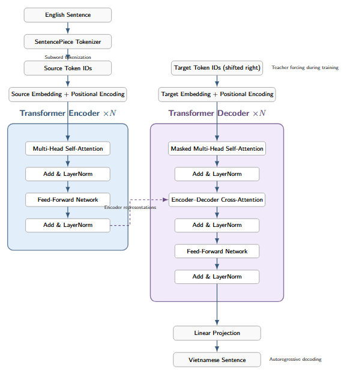

# English–Vietnamese Neural Machine Translation

A learning project implementing an English–Vietnamese Neural Machine Translation (NMT) system using a Transformer architecture built from scratch with PyTorch.

The main goal of this project is to understand and implement the core components of the Transformer architecture, NLP preprocessing, model training, and sequence-to-sequence inference rather than building a production-ready translation system.

## Overview

This project implements an encoder–decoder Transformer for English → Vietnamese translation.

The project covers:

* Transformer architecture implemented from scratch with PyTorch
* Multi-Head Self-Attention
* Encoder–Decoder Cross-Attention
* Positional Encoding
* Feed-Forward Networks
* Residual Connections & Layer Normalization
* Padding and causal masking
* SentencePiece tokenization
* PyTorch dataset and data preprocessing pipeline
* Mixed-precision training
* Gradient accumulation
* Learning-rate scheduling
* Model checkpointing
* Greedy and beam-search decoding
* BLEU-based evaluation

## Architecture

The overall translation pipeline is:



## Model

The Transformer is implemented manually rather than using a pre-built Transformer module.

Main components include:

* Token Embedding
* Positional Encoding
* Multi-Head Attention
* Encoder Layer
* Decoder Layer
* Feed-Forward Network
* Layer Normalization
* Residual Connections
* Encoder–Decoder Attention
* Output Projection

The implementation is located mainly in:

```text
model.py
```

## Tokenization

The project uses **SentencePiece** for subword tokenization.

Separate tokenizers are trained for English and Vietnamese to convert sentences into token IDs before being passed to the Transformer.

The tokenizer training pipeline is provided in:

```text
train_tokenizer.py
```

Special tokens such as padding, unknown, beginning-of-sequence, and end-of-sequence tokens are handled during preprocessing.

## Dataset

The dataset consists of parallel English–Vietnamese text pairs crawled from huggingface.

The preprocessing pipeline performs:

1. Loading the parallel dataset
2. Tokenization with SentencePiece
3. Adding special tokens
4. Padding and truncation
5. Creating encoder and decoder inputs
6. Building PyTorch datasets and dataloaders

Main implementation:

```text
dataset_loader.py
```

## Training

The training pipeline is implemented in:

```text
train.py
```

Training includes:

* Adam/AdamW optimization
* Gradient accumulation
* Mixed-precision training
* Gradient clipping
* Learning-rate scheduling
* Validation during training
* Best-model checkpointing

The best checkpoint is saved for later evaluation and inference.

## Evaluation

The model is evaluated on a held-out test set using **SacreBLEU**.

Current evaluation:

| Metric                  |     Value |
| ----------------------- | --------: |
| Test sentences          |     1,000 |
| Corpus BLEU             |     26.86 |
| Average Sentence BLEU   |      6.42 |
| Minimum Sentence BLEU   |      0.00 |
| Maximum Sentence BLEU   |     42.73 |
| Sentence BLEU Std. Dev. |      5.22 |

### BLEU

The primary metric reported here is Corpus BLEU.

Corpus BLEU evaluates the model across the complete test set by comparing generated translations with their reference translations using n-gram precision and a brevity penalty.

> Corpus BLEU: 26.86 on 1,000 test sentences

Sentence-level BLEU statistics are included for additional analysis but are not used as the primary model metric.

## Inference

The project supports sequence generation using the trained checkpoint.

Two decoding approaches are available:

* Greedy decoding
* Beam search

The translation/inference logic is implemented in:

```text
translator.py
```

*Example output may vary depending on the trained checkpoint and decoding configuration.*

## Installation

Clone the repository:

```bash
git clone https://github.com/Goldvcrown/Translator.git
cd Translator
```

Create a virtual environment:

```bash
python -m venv .venv
```

Activate it on Windows:

```powershell
.venv\Scripts\activate
```

Install dependencies:

```bash
pip install -r requirements.txt
```

## Training

To train the model:

```bash
python train.py
```

The training configuration can be adjusted in:

```text
config.py
```

## Evaluation

To evaluate the trained model:

```bash
python evaluate.py
```

The evaluation script generates translations on the test set and reports Corpus BLEU together with sentence-level BLEU statistics.

## Translation

To run translation using the trained checkpoint:

```bash
python translator.py
```

## Limitations

This project is primarily an educational implementation of a Transformer-based NMT system.

The current model has several limitations:

* The model and training setup are relatively small compared with modern production NMT systems.
* BLEU depends strongly on the dataset, tokenizer, preprocessing, and reference translations.
* Translation quality can vary significantly between individual sentences.
* The current evaluation uses a single reference translation per test example.
* The project focuses on understanding the Transformer and NMT pipeline rather than production deployment or state-of-the-art translation quality.

## What I Learned

Through this project, I gained practical experience with:

* Implementing Transformer components from the original architecture
* Understanding self-attention and cross-attention
* Designing sequence-to-sequence training pipelines
* Handling padding and attention masks
* Subword tokenization with SentencePiece
* Teacher-forcing during decoder training
* Autoregressive sequence generation
* Beam-search decoding
* Mixed-precision and GPU training
* Model checkpointing
* Evaluating NMT models using BLEU

## Tech Stack

* Python
* PyTorch
* SentencePiece
* Hugging Face Datasets
* SacreBLEU
* CUDA
* NumPy


